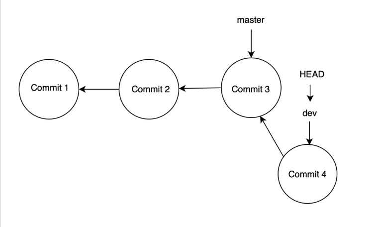
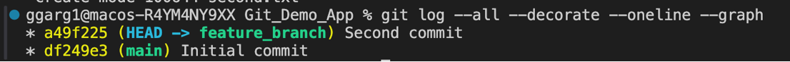
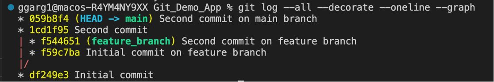
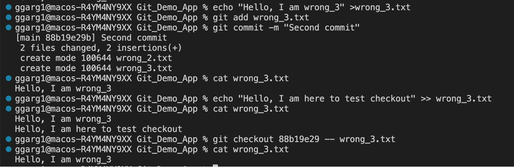

## Let's talk about Git stash ##

**Firstly, what is a stash in Git?**

Stash can be said to a private locker where the changes are stored temporarily, anything that is stashed is not a part of the commit.

Technically speaking, whenever we have some code changes that we don't want to be part of the next commit, we can add those changes to the staging area and use `git stash`. It's important to know that stash behaves like a stack data structure.

**What are the usecases of Git stash in real life projects?** 

1) Switching between branches on Git: Often, when you’ve been working on part of your project, things are in a messy state and you want to switch branches for a bit to work on something else. The problem is, you don’t want to do a commit of half-done work just so you can get back to this point later. The answer to this issue is the `git stash` command.

Stashing takes the dirty state of your working directory — that is, your modified tracked files and staged changes — and saves it on a stack of unfinished changes that you can reapply at any time (even on a different branch).

**Let's also clear one of the doubts: When does Git give a warning when switching branches**

Reference from this link: [Stackoverflow Link](https://stackoverflow.com/questions/38029499/git-does-not-warn-me-about-changes-when-switching-branches#:~:text=You%20get%20a%20message%20asking,to%20stash%20or%20commit%20changes) 

Git **doesn't always** give a warning if you have changes in the working directory/staging area and you try to switch to a different branch. The default behaviour is to copy everything from working directory/staging area to the branch that you are checking out to. **Git only gives a warning if there are going to be conflicts while switching the branches**. Let's see this in action:

No conflicts, hence no warning. Changes from previous branch copied to the latest branch:


From the screenshot above, we can see that when we checkout to main branch from dev branch, as there are no conflicts in README.md, the changes from dev branch are copied to the main branch.

There are going to be conflicts, hence Git gives a warning while switching branches:


From the screenshot above, we can see that Git asks us to commit or stash the changes before switching branches, when it sees that a conflict can occur due to switching of branches.

2) Using local overrides or configurations: At times, there are certain mock props, API keys or AWS credentials etc which we need to use in the local working directory, but we don't want to push them to the remote repository. In this case, we can stash the configurations etc before pushing to the remote repository. 

**Let's now try to use git stash**

For the demonstration purpose, let's create `correct.js` and `wrong.js` . `wrong.js` is a piece of dirty code that we don't want to be present in the next commit, hence we will use git stash.

Before git stash:


After git stash:


As we can see from the screenshots above, we committed `correct.js` and staged `wrong.js` for stashing. Before stashing, the working directory had both `correct.js` and `wrong.js` in it, but after using `git stash`, the staged files (wrong.js) were moved to the stash, and the working directory only had `correct.js`

**Let's also take a look at the message which we got while stashing the changes and try to understand:** 

`Saved working directory and index state WIP on main: 027e083 Initial commit` 

This message tells us that by using `git stash`, the working directory and the staging area work-in-progress from the branch main (which points to the commit 027e083 with the commit message Initial commit) has been saved into stash.

Another important note: By using the `--include-untracked` flag, we can stash the changes both from working area as well as the staging area. Without this flag, git only stashes the changes from staging area.

`git stash list` lists the current stash entries. Each stash entry is listed with its name (e.g. stash@{0} is the latest entry, stash@{1} is the one before, etc.), the name of the branch that was current when the entry was made, and a short description of the commit the entry was based on. See the screenshot below:


`git stash apply` reapplies the changes stashed in the latest stash, and also doesn't remove the state from the stash list. See the screenshot below:


`git stash show stash@{stash_index}` shows the diff between the stashed contents and the commit back when the stash entry was first created. As an example, if the stash was created when the last commit was '01234', this command shows the diff between the stashed contents and commit '01234'. See the example below:


**Let's try to create multiple stashes, and see how we can apply a specific stash**

For the purpose of this demonstration, we have created two different stashes on two different files `wrong.js` and `wrong_2.js`. When we use `git stash apply`, we see the output as below:


Let's try to apply both of the stashes one by one:


From the screenshot above, we can see that when we apply the most recent stash, we get back the `wrong_2.js` in the working directory.


From the screenshot above, we can see that when we apply the second stash, we get back the `wrong.js` back in the working directory. (The `wrong_2.js` file is from the stash applied in the previous step).

Sometimes, there can be merge conflicts when different stashes work on the same set of lines of the same file. In such cases, we need to resolve the merge conflict. For demonstration, we will be creating two stashes on the same file `wrong.js`. We'll then try to apply the stashes, it will lead to a merge conflict. See below:


As we can see from the screenshot above, there's a merge conflict when the two stashes work on the same set of files. We need to resolve the conflict in such a case, VS code provides a convenient interface to resolve the merge conflicts.


**How to include specific files only in the stash?**

Approach #1 : Only stage those specific file(s) to the staging area. Then use `git stash`

Approach #2 : Use `git stash -- <filename>` (for files in staging area) or `git stash --include-untracked -- <filename>` (for files in working area). See the screenshot below: 


Let's talk about `git stash pop`: This command is used to remove the changes from stash and reapply them to the working copy. As an example, we are going to create a stash for creating a new file `dummy_stash_pop.txt`, and then we will use `git stash pop` on it.


As we can see from the screenshot above, on using `git stash pop`, the changes from the stash were applied to the working directory, and also the stash entry was popped from the stack.

`git stash drop stash@{index}` removes the stash entry from the list of stash entries, without applying the stash changes to the working directory. See the screenshot below:


`Git stash clear` clears all the stash entries. See screenshot below:


By default, Git automatically generates stash message based on the branch and the commit when creating a stash entry. However, we can give custom stash message, using:

1. `git stash save <stash message>`: If the changes are staged

2. `git stash save <stash message> --include-untracked`: If the changes are in the working area and not staged. See the screenshots below:


**How to add a new file to an already existing git stash?**

There's a hack/workaround to do this:

1. Use `git stash pop` to apply the changes from the latest stash entry to the working directory. This also pops the entry from the stack.

2. Now stage all the files, including the new file(s) that you want to stash.

3. Now use `git stash` to stash the changes.

See demonstration below: here we demonstrated how we can add a file `newfile.js` to an existing stash.


**Let's also discuss how we can include a new file in a commit, without creating a new commit for it**

Refer to this link to learn about `git commit --amend` [Atlassian Documentation](https://www.atlassian.com/git/tutorials/rewriting-history#:~:text=The%20git%20commit%20%2D%2Damend,message%20without%20changing%20its%20snapshot.)

1. Stage the new file using `git add <filename>`

2. Use `git commit --amend` to include the staged file in the commit. Optionally, we can edit the commit message as well.

Let's see this in action.


From the screenshot above, we can see that there's one commit in the commit history, and the commit object stores the changes from `correct.js` file.


From the screenshot above, we can see that `README.txt` has been added to the commit. 

Moreover, by inspecting the commit object, we can see that the commit stores the changes from both `README.txt` and `correct.js`

However, there's one most important point to notice: The commit hash has changed ! Let's see why this happens:

1) The commit object stores a pointer to the tree object. As the tree object changes between the two commits (due to keeping track of different changes), so it changes the commit object as well. Refer the repository on Git Internals for deeper understanding: [Link to Github repository](https://github.com/girikgarg8/Git-Internals)

2) The commit object stores the timestamp at which the commit was created. Since it changes when we amend the commit, the commit object is changed.

Let's now explore about `git reflog` : 

**What is it?**

Refer to this article: [Article Link](https://graphite.dev/blog/every-engineer-should-understand-git-reflog)

Reflog is short for "Reference log". It is a file that stores the **chronological list of all changes made to the HEAD pointer** in the Git repository. Since the HEAD is a pointer to the current branch (that you are working on), and branch is a pointer to a commit, in essence, reflog tracks every commit ever made in the repository.

It's always to debunk a myth that 'HEAD always (indirectly) points to the latest commit on the current branch' --> This statement is not always correct. The `HEAD may not always point to the latest commit on the current branch- the HEAD might point to a commit instead of pointing to a branch (Detached state)`

See this stackoverflow answer for more details: [Stackoverflow Link](https://softwareengineering.stackexchange.com/questions/363312/does-git-head-pointer-generally-usually-points-to-the-latest-last-end-commit-o)

**How is it different from `git log`?** 

See this Stackoverflow answer : [Link](https://stackoverflow.com/questions/17857723/whats-the-difference-between-git-reflog-and-log)

`git log` shows the current HEAD and its ancestry. What `git log` does it it prints the commit HEAD points to, then its parent, and so on. It traverses back through the repo's ancestry, by recursively looking up each commit's parent.

`git reflog` doesn't traverse HEAD's ancestry at all. The reflog stores the chronological order of all the changes made to the HEAD pointer. The reflog isn't part of the repo itself (it's stored separately to the commit themselves) and isn't included in pushes, fetches or clones, it's purely local.

On a side note, `git reflog` acts as a safety net. If you accidentally reset to an older commit, or rebase wrongly, or any other operation that visually "removes" commits, you can use the reflog to see where you were before and `git reset --hard` back to that ref to restore your previous state.

See the screenshot below:


As we can see from the screenshot above, the `reflog` shows all the changes to the `HEAD` pointer, `HEAD@{n}` indicates `where HEAD pointer used to be n moves ago`. Also, when we amend the commit, it doesn't show up in the `commit history` but would reflect in the `reflog`.

**Let's now explore about branches in Git**

Branches are one of the most misunderstood concepts in Git.


Many people visualize Git branches as parallel timelines of the project/repository, similar to what is depicted in the figure above. This understanding is good for visualization, but it's not entirely correct.

Precisely speaking, **`Branch is a pointer to commit in the commit history`**. It's important to know this fact so that going forward, we can understand the concept of `git reset` properly.

The correct understanding of commit is depicted in the screenshot below:


Let's understand what happens, when we create a new branch using `git checkout -b <branch name>`. For the demonstration,let's consider that we checkout the `dev` branch from the `master` branch.


As we can see from the figure above, when we checkout a new branch, we are just creating a new pointer to the current commit. Now, as we create commits in the commit history, the branch pointer also updates itself, see the figure below:



**Let's also talk about the HEAD pointer**

'HEAD' is also one of the most misunderstood concepts in Git. 

Precisely speaking, HEAD points to the current branch you're working on, and since a branch points to a commit, HEAD indirectly points to a current (not necessarily the latest) branch on the current branch.

**Let's play around with HEAD pointer:**


As we can see from the `git log`, the `HEAD` points to the `main` branch, and the `main` branch points to the `initial commit`.

Let's try to checkout a new branch, and see:


From the screenshot above, we can observe that:

1. When we checkout a new branch, both the `main` and the `feature_branch` are pointing to the same commit.

2. The `HEAD` pointer is pointing to the current branch `feature_branch`.

Let's now try to create another commit in the `feature_branch` branch, and see the changes in the `feature_branch` and the `HEAD` pointer.


From the screenshot above, we can see that the `main` branch points to the previous commit, and the `feature_branch` branch points to the new commit. Also, the `HEAD` pointer also moves along with the `feature_branch` branch pointer.

Let's also explore a command that we'll be using to visualize the commit history in the form of a graph:

`git log --all --decorate --oneline --graph`

Let's do a step by step analysis of this command:

`--all` shows all the branches, not just the current branch.

`--decorate` makes the `git log` display all the references (like tags, branches) that point to a commit.

`--oneline` flag condenses each commit to a single line.

`--graph` option draws an ASCII graph representing the branch structure of the commit history.

See this link [Atlassian Documentation](https://www.atlassian.com/git/tutorials/git-log) for more details, also refer to the example below:

 

In order to see all the branches, use `git branch`. 

To switch to a particular branch, use `git checkout <branch name>`

**Let's talk about divergent branches**

Divergent branches in Git are two branches that have diverged from a common commit in the commit history. As an example, consider the figure below:


The two branches `master` and `feature_branch` are divergent because they diverge from a common commit. Let's see this in the `git log` as well:


From the screenshot above, we can see that there are two divergent branches from a common commit.

**Let's also learn how to read the Git log graph**



The vertices (marked by asterisks) represents the commits in the commit history. The two parallel timelines (edges) indicate the different branches.

We can also explore `Gitlens for VS Code` extension which allows us to visualize the commit graph, authorship of code (blame annotations) etc.

**How to check which branch HEAD is pointing to?**

Option 1: Check using `git log`.

Option 2: Inspect the contents of `.git/HEAD`, see example below:


Let's take a look at the `Git feature branch workflow` :


The developers in a team checkout a new feature branch from the master branch. When they are done with their changes, they don't directly merge their code to the production branch, they instead merge their code to the test branch. The QA/tester folks thoroughly test the code using unit tests, integration tests, end-to-end tests etc. Once the tests are passed, it is then merged to the production branch. Usually, only few developers are given access to merge to production branch.

Hotfix branches : They allow developers to quickly fix critical issues in a production environment by working with the exact code deployed in production. 

The workflow can differ depending upon the company structure or the team preferences.

**Let's talk about tags in Git**

Tag is a pointer to a specific commit in the commit history. It is different from a branch as a tag always points to a specific commit in the commit history, whereas the branch pointer changes when new commits are created in the commit history.

The syntax for creating a tag in Git is `git tag -a <annotation> -m <tag message>`.

Both the `-a` and `-m` options are mandatory to create a tag. The annotation is a quick description of the tag, whereas the tag message is a detailed description of the tag.

Let's see this in action:


From the screenshots above, we can see that the `tag pointer` doesn't move with the commits in the commit history, whereas the `branch pointer` moves when new commits are created in the commit history.

In order to view a tag, use `git tag <tag annotation>`


The tag object stores the tag annotation, tagger details, date and time of creating the tag, tag message and the details of the commit which the tag points to. 

To see all the tags, we can use `git show-ref --tags` or list the contents of `.git/refs/tags`, see the screenshots below:


In order to push the git tag to Github, use the syntax `git push origin <tag name>`. 

If we wish to push all the tags, we can use `git push --tags` (not recommended though).

**Let's now talk about open source contributions**

Tips on how to contribute to an open source repository:

1. Try to go through any live link of the project, and explore around.

2. Setup the repository on your local. Consult the documentation to see the installation steps, contribution guide, Code of Conduct etc

3. Go through the list of open issues - these can be bugs, feature requests etc.

4. As a new contributor, try to look for an issue which is labelled as  a `good first issue`. 

5. Since you might not be added as a collaborator to the repository, fork the repository. Then clone the forked repository using `git clone <repository URL>` 

6. Checkout a new branch for the feature/bug that you will be working on.

7. Make the required code changes. Make sure to use semantic commit messages. See this [link](https://gist.github.com/joshbuchea/6f47e86d2510bce28f8e7f42ae84c716) for more details.

8. Raise a pull request (PR). Address comments, if any on the PR. Else congratulations on your contribution !

**Let's learn about upstream repository in Git**

**What is it?**

Refer to the diagram below:


Talking about upstream and downstream: 

In terms of source control, you're downstream when you clone from a repository. Information flowed "downstream" to you.

When you make changes, you usually want to send them back "upstream" so they make it into that repository so that everyone pulling from the same source is working with all the same changes.

**What are the ways to set the upstream?**

There are two ways to set the upstream:

1. By changing the fetch URL of the `origin` remote: 

```
git remote set-url origin /original/repo
git remote set-url --push origin /your/fork
```

See example below:


This is not the recommended way to set the upstream.

2. By adding a new upstream remote:

```
git remote add origin upstream /original/repo
```

Use this remote to pull the changes using `git pull upstream <branch name>`. See the screenshots below:


If you're aiming to contribute to Google Summer of Code (GSoC), there's a proposal document that you need to submit to the organization. See this [example](https://drive.google.com/file/d/1tG33LLWhy2lApiXaPl1ukRv7xho0V-Ne/view) for reference.

## Let's now learn about how we can fix mistakes in Git ##

**Before we go ahead, there's an important lesson : `git checkout` is not only used to switch or create branches -  it can also be used to revert changes, checkout to a commit etc .**

`git checkout -- <file>` restores the file to the last staged version, discarding any changes in the working area. See the [documentation](https://git-scm.com/docs/git-checkout) for more details.

Let's see this in action: 


As we can see from the screenshot above, the contents of `wrong_2.txt` are replaced by the last staged version.

The documentation also mentions `When the <tree-ish> is given, overwrite both the index and the working tree with the contents at the <tree-ish>.` What this means is that, by using `git checkout <commit hash> -- <file>`, we can revert the file to its version in that specific commit.

Let's see this in action:



As we can see from the screenshot above, the contents of `wrong_3.js` are reverted to those of the specified commit.

**Let's now talk about `git clean`**

`git clean` is a convenient method for deleting untracked files in a repo's working directory. Let's explore some of the options :

1. `--dry-run` : Don’t actually remove anything, just show what would be done.

2. `-d` : Specify the directories also in the working directory. Without this flag, `git clean` will only list the files in the working directory.

3. `-f` : If the git configuration variable `clean.requireForce` is not set to false, `git clean` will refuse to delete files or directories unless given `-f` or `-i` (interactive mode).

Let's see this in action:


From the screenshot above, we can see that by using the dry run, `git clean` tells us what files would be removed.


From the screenshot above, we can see that by using the `-d` flag, we are able to list the directories as well.


From the above screenshot, we can see that only the files got deleted in absence of the `-d` flag.

 

From the above screenshot, we can see that both files and directories got deleted by using `-d` flag.

## Let's talk about the detached HEAD state ##

**What is detached HEAD state?**

Detached HEAD state is when HEAD pointer points to a commit directly, instead of pointing to a branch.
As an example, consider the figure below:


**How does one get into the detached HEAD state?**

You might get into the detached HEAD state, if you checkout to a commit by using `git checkout <commit>`. By using this command, the HEAD moves to the specified commit, thereby resulting in detached HEAD state.

**What are the problems of being in detached HEAD state?**

Let's understand this with the help of an illustration.

Consider the `git log` before the `HEAD` was in detached head state :


As we can see from the screenshot above, that the main branch points to the latest commit, and the `HEAD` points to the branch.

Consider the `git log` after the `HEAD` is in detached head state :


Let's now discuss what the problems are, being in detached head state:

1. As we can see, the HEAD points to a commit, and lists the ancestor commits. The details of other commits (like the third and fourth commit) have vanished. (Why is it so? We discussed this earlier as well- it's because Git traverses the commit ancestry starting from the commit where HEAD points). Now, if by chance, the `master branch pointer` moves, then we might end up losing the branch pointer.

2. There is a possibility of dangling commits while being in detached state. A dangling commit is a commit which is not referenced by any commit/branch/HEAD. Let's understand how this can happen:

Let's say this is the situation right now:


Now let's say, from the `HEAD` pointer, you make new commits, and that too, **without checking out a new branch**, so the situation is something along:


Now, let's say after this, you checkout to the `master` branch, so the situation is something along:


Now carefully note from the figure above, that the commit E is a dangling commit (as it doesn't have any other commit, branch or HEAD referencing to it). Similarly, commit D is also a dangling commit (The reference from commit E is not considered valid because E is itself a dangling commit). Hence, we have two dangling commits D and E. **The next time, Git does garbage collection, both these commits are going to be garbage collected and we will lose our changes**.

However, the situation would have been different if we checked a new branch before making new commits. In that case, our commits would have not been dangling commits. See the figure below:


**This is the reason why Git prompts us to checkout a new branch before making a new commit from detached HEAD.**

References for the second point: 

[Git Documentation](https://git-scm.com/docs/git-checkout)
[Stackoverflow link](https://softwareengineering.stackexchange.com/questions/363312/does-git-head-pointer-generally-usually-points-to-the-latest-last-end-commit-o)

**How can we get out of the detached HEAD state?**

Option 1: Checkout to the branch using `git checkout <branch name>`. See example below:


Option 2: Use `git switch -` (as suggested by the Git prompt). See example below:


**Let's also see how we can use filters on `git log`**

We can use filters like filtering commits based on their time, or use regex search on commit messages. See examples below:

`git log --since="yesterday"`


`git log --since=7.hour`


`git log --grep=Second`


**Let's now talk about HEAD^ and HEAD~ in Git**

These are frequently used in `git reset` command.

Reference Link: [Stackoverflow Link](https://stackoverflow.com/questions/2221658/whats-the-difference-between-head-and-head-in-git)

The difference:

1. `HEAD~n` refers to the nth ancestor of HEAD. As an example, `HEAD~2` would mean the grandparent of HEAD.

2. `HEAD^n` refers to the nth parent of HEAD. As an example, `HEAD^2` would mean the 2nd parent of HEAD. This is particularly useful in case of merge commits, which have multiple parents. And yes, a commit can have more than 2 parents as well, see [this](https://softwareengineering.stackexchange.com/questions/314215/can-a-git-commit-have-more-than-2-parents) as an example.

The mnemonic to remember this difference:

1. `~` looks almost linear and wants to backward in a straight line.

2. `^` looks like a fork and suggests a merge commit.

**Let's understand merge commit and fast-forward merge**

Let's consider the situation before making a merge commit, we have two branches: main and `feature_branch`. We want to merge the `feature_branch` into the main branch, so we checkout to the main branch and use `git checkout feature_branch`.


After the feature branch is merged into the main, the situation is something along:


Notice carefully, that the master branch points to the merge commit, and the feature branch still points to the latest commit on the commit before the merge.

Let's replicate this scenario in Git and see:

Git log before merge commit:


Git log after merge commit:


Please note that the commit ID `47f0c83` is referred to with an asterisk, in fact every commit is represented by an asterisk in the graph.

Let's now try to see the first parent of the merge commit (the commit on the master branch):


Let's try to see the second parent of the merge commit (the commit on the feature branch):


Let's try to see the first parent and the grandparent (parent's parent commit) of HEAD:


**Now let's understand fast forward merge**

Fast forward merge is used when we want to merge two branches which have not diverged yet. As an example, consider the situation below:


The branches `master` and `feature branch` are not divergent branches. Hence, if we want to merge `feature branch` into `master`, we don't need to create a merge commit. Instead, we can move the `master branch pointer` to point to the commit that `feature branch` is pointing to. The situation after the fast forward merge would be:


Let's also see this in action in Git:

The situation before fast forward merge:


The situation after fast forward merge:


Using `HEAD~` after fast forward merge:

