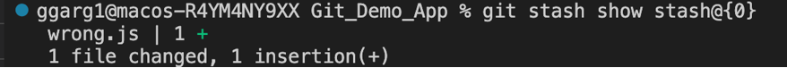

## Let's talk about Git stash ##

**Firstly, what is a stash in Git?**

Stash can be said to a private locker where the changes are stored temporarily, anything that is stashed is not a part of the commit.

Technically speaking, whenever we have some code changes that we don't want to be part of the next commit, we can add those chages to the staging area and use `git stash`. It's important to know that stash behaves like a stack data structure.

**What are the usecases of Git stash in real life projects?** 

1) Switching between branches on Git: Often, when you’ve been working on part of your project, things are in a messy state and you want to switch branches for a bit to work on something else. The problem is, you don’t want to do a commit of half-done work just so you can get back to this point later. The answer to this issue is the `git stash` command.

Stashing takes the dirty state of your working directory — that is, your modified tracked files and staged changes — and saves it on a stack of unfinished changes that you can reapply at any time (even on a different branch).

**Let's also clear one of the doubts: When does Git give a warning when switching branches**

Reference from this link: [Stackoverflow Link](https://stackoverflow.com/questions/38029499/git-does-not-warn-me-about-changes-when-switching-branches#:~:text=You%20get%20a%20message%20asking,to%20stash%20or%20commit%20changes) 

Git **doesn't always** give a warning if you have changes in the working directory/staging area and you try to switch to a different branch. The default behaviour is to copy everything from working directory/staging area to the branch that you are checking out to. **Git only gives a warning if there are going to be conflicts while switching the branches**. Let's see this in action:

No conflicts, hence no warning. Changes from previous branch copied to the latest branch:

From the screenshot above, we can see that when we checkout to main branch from dev branch, as there are no conflicts in README.md, the changes from dev branch are copied to the main branch.

There are going to be conflicts, hence Git gives a warning while switching branches:

From the screenshot above, we can see that Git asks us to commit or stash the changes before switching branches, when it sees that a conflict can occur due to switching of branches.

2) Using local overrides or configurations: At times, there are certain mock props, API keys or AWS credentials etc which we need to use in the local working directory, but we don't want to push them to the remote repository. In this case, we can stash the configurations etc before pushing to the remote repository. 

**Let's now try to use git stash**

For the demonstration purpose, let's create `correct.js` and `wrong.js` . `wrong.js` is a piece of dirty code that we don't want to be present in the next commit, hence we will use git stash.

Before git stash:

After git stash:

As we can see from the screenshots above, we committed `correct.js` and staged `wrong.js` for stashing. Before stashing, the working directory had both `correct.js` and `wrong.js` in it, but after using `git stash`, the staged files (wrong.js) were moved to the stash, and the working directory only had `correct.js`

**Let's also take a look at the message which we got while stashing the changes and try to understand:** 

`Saved working directory and index state WIP on main: 027e083 Initial commit` 

This message tells us that by using `git stash`, the working directory and the staging area work-in-progress from the branch main (which points to the commit 027e083 with the commit message Initial commit) has been saved into stash.

Another important note: By using the `--include-untracked` flag, we can stash the changes both from working area as well as the staging area. Without this flag, git only stashes the changes from staging area.

`git stash list` lists the current stash entries. Each stash entry is listed with its name (e.g. stash@{0} is the latest entry, stash@{1} is the one before, etc.), the name of the branch that was current when the entry was made, and a short description of the commit the entry was based on. See the screenshot below:

`git stash apply` reapplies the changes stashed in the latest stash, and also doesn't remove the state from the stash list. See the screenshot below:

`git stash show stash@{stash_index}` shows the diff between the stashed contents and the commit back when the stash entry was first created. As an example, if the stash was created when the last commit was '01234', this command shows the diff between the stashed contents and commit '01234'. See the example below:

**Let's try to create multiple stashes, and see how we can apply a specific stash**

For the purpose of this demonstration, we have created two different stashes on two different files `wrong.js` and `wrong_2.js`. When we use `git stash apply`, we see the output as below:

Let's try to apply both of the stashes one by one:

From the screenshot above, we can see that when we apply the most recent stash, we get back the `wrong_2.js` in the working directory.

From the screenshot above, we can see that when we apply the second stash, we get back the `wrong.js` back in the working directory. (The `wrong_2.js` file is from the stash applied in the previous step).

Sometimes, there can be merge conflicts when different stashes work on the same set of lines of the same file. In such cases, we need to resolve the merge conflict. For demonstration, we will be creating two stashes on the same file `wrong.js`. We'll then try to apply the stashes, it will lead to a merge conflict. See below:

As we can see from the screenshot above, there's a merge conflict when the two stashes work on the same set of files. We need to resolve the conflict in such a case, VS code provides a convenient interface to resolve the merge conflicts.

**How to include specific files only in the stash?**

Approach #1 : Only stage those specific file(s) to the staging area. Then use `git stash`

Approach #2 : Use `git stash -- <filename>` (for files in staging area) or `git stash --include-untracked -- <filename>` (for files in working area). See the screenshot below: 

Let's talk about `git stash pop`: This command is used to remove the changes from stash and reapply them to the working copy. As an example, we are going to create a stash for creating a new file `dummy_stash_pop.txt`, and then we will use `git stash pop` on it.

As we can see from the screenshot above, on using `git stash pop`, the changes from the stash were applied to the working directory, and also the stash entry was popped from the stack.

`git stash drop stash@{index}` removes the stash entry from the list of stash entries, without applying the stash changes to the working directory. See the screenshot below:

`Git stash clear` clears all the stash entries. See screenshot below:

By default, Git automatically generates stash message based on the branch and the commit when creating a stash entry. However, we can give custom stash message, using:

1. `git stash save <stash message>`: If the changes are staged

2. `git stash save <stash message> --include-untracked`: If the changes are in the working area and not staged. See the screenshots below:

**How to add a new file to an already existing git stash?**

There's a hack/workaround to do this:

1. Use `git stash pop` to apply the changes from the latest stash entry to the working directory. This also pops the entry from the stack.

2. Now stage all the files, including the new file(s) that you want to stash.

3. Now use `git stash` to stash the changes.

See demonstration below: here we demonstrated how we can add a file `newfile.js` to an existing stash.

**Let's also discuss how we can include a new file in a commit, without creating a new commit for it**

Refer to this link to learn about `git commit --amend` [Atlassian Documentation](https://www.atlassian.com/git/tutorials/rewriting-history#:~:text=The%20git%20commit%20%2D%2Damend,message%20without%20changing%20its%20snapshot.)

1. Stage the new file using `git add <filename>`

2. Use `git commit --amend` to include the staged file in the commit. Optionally, we can edit the commit message as well.

Let's see this in action.

From the screenshot above, we can see that there's one commit in the commit history, and the commit object stores the changes from `correct.js` file.

From the screenshot above, we can see that `README.txt` has been added to the commit. 

Moreover, by inspecting the commit object, we can see that the commit stores the changes from both `README.txt` and `correct.js`

However, there's one most important point to notice: The commit hash has changed ! Let's see why this happens:

1) The commit object stores a pointer to the tree object. As the tree object changes between the two commits (due to keeping track of different changes), so it changes the commit object as well. Refer the repository on Git Internals for deeper understanding: [Link to Github repository](https://github.com/girikgarg8/Git-Internals)

2) The commit object stores the timestamp at which the commit was created. Since it changes when we amend the commit, the commit object is changed.

Let's now explore about `git reflog` : 

**What is it?**

Refer to this article: [Article Link](https://graphite.dev/blog/every-engineer-should-understand-git-reflog)

Reflog is short for "Reference log". It is a file that stores the **chronological list of all changes made to the HEAD pointer** in the Git repository. Since the HEAD is a pointer to the current branch (that you are working on), and branch is a pointer to a commit, in essence, reflog tracks every commit ever made in the repository.

It's always to debunk a myth that 'HEAD always (indirectly) points to the latest commit on the current branch' --> This statement is not always correct. The `**HEAD may not always point to the latest commit on the current branch- the HEAD might point to a commit instead of pointing to a branch (Detached state)`

See this stackoverflow answer for more details: [Stackoverflow Link](https://softwareengineering.stackexchange.com/questions/363312/does-git-head-pointer-generally-usually-points-to-the-latest-last-end-commit-o)

**How is it different from `git log`?** 

See this Stackoverflow answer : [Link](https://stackoverflow.com/questions/17857723/whats-the-difference-between-git-reflog-and-log)

`git log` shows the current HEAD and its ancestry. What `git log` does it it prints the commit HEAD points to, then its parent, and so on. It traverses back through the repo's ancestry, by recursively looking up each commit's parent.

`git reflog` doesn't traverse HEAD's ancestry at all. The reflog stores the chronological order of all the changes made to the HEAD pointer. The reflog isn't part of the repo itself (it's stored separately to the commit themselves) and isn't included in pushes, fetches or clones, it's purely local.

On a side note, `git reflog` acts as a safety net. If you accidentally reset to an older commit, or rebase wrongly, or any other operation that visually "removes" commits, you can use the reflog to see where you were before and `git reset --hard` back to that ref to restore your previous state.

See the screenshot below:

As we can see from the screenshot above, the `reflog` shows all the changes to the `HEAD` pointer, `HEAD@{n}` indicates `where HEAD pointer used to be n moves ago`. Also, when we amend the commit, it doesn't show up in the `commit history` but would reflect in the `reflog`.