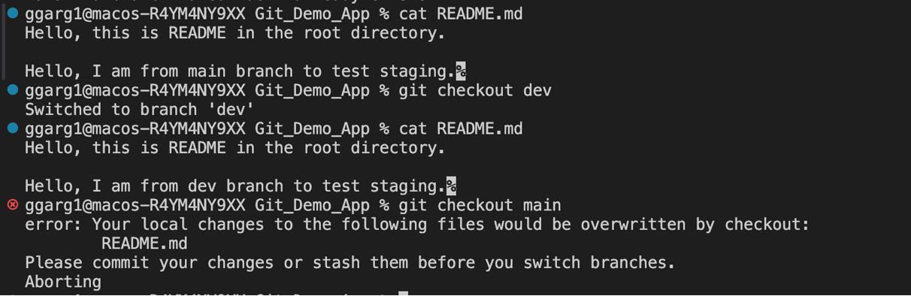

## Let's talk about Git stash ##

**Firstly, what is a stash in Git?**

Stash can be said to a private locker where the changes are stored temporarily,  anything that is stashed is not a part of the commit.

Technically speaking, whenever we have some code changes that we don't want to be part of the next commit, we can add those chages to the staging area and use `git stash`.

**What are the usecases of Git stash in real life projects?** 

1) Switching between branches on Git: Often, when you’ve been working on part of your project, things are in a messy state and you want to switch branches for a bit to work on something else. The problem is, you don’t want to do a commit of half-done work just so you can get back to this point later. The answer to this issue is the `git stash` command.

Stashing takes the dirty state of your working directory — that is, your modified tracked files and staged changes — and saves it on a stack of unfinished changes that you can reapply at any time (even on a different branch).

**Let's also clear one of the doubts: When does Git give a warning when switching branches**

Reference from this link: [Stackoverflow Link](https://stackoverflow.com/questions/38029499/git-does-not-warn-me-about-changes-when-switching-branches#:~:text=You%20get%20a%20message%20asking,to%20stash%20or%20commit%20changes) 

Git **doesn't always** give a warning if you have changes in the working directory/staging area and you try to switch to a different branch. The default behaviour is to copy everything from working directory/staging area to the branch that you are checking out to. **Git only gives a warning if there are going to be conflicts while switching the branches**. Let's see this in action:

No conflicts, hence no warning. Changes from previous branch copied to the latest branch:

From the screenshot above, we can see that when we checkout to main branch from dev branch, as there are no conflicts in README.md, the changes from dev branch are copied to the main branch.

There are going to be conflicts, hence Git gives a warning while switching branches:

From the screenshot above, we can see that Git asks us to commit or stash the changes before switching branches, when it sees that a conflict can occur due to switching of branches.

2) Using local overrides or configurations: At times, there are certain mock props, API keys or AWS credntials etc which we need to use in the local working directory, but we don't want to push them to the remote repository. In this case, we can stash the configurations etc before pushing to the remote repository. 

**Let's now try to get our hands on stash**

